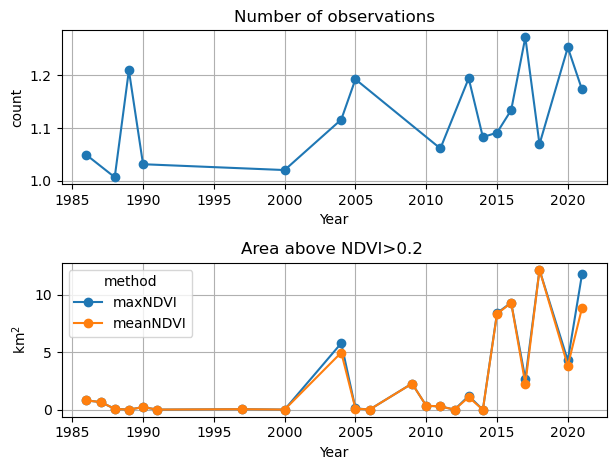
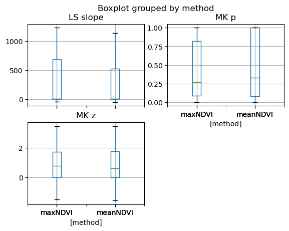
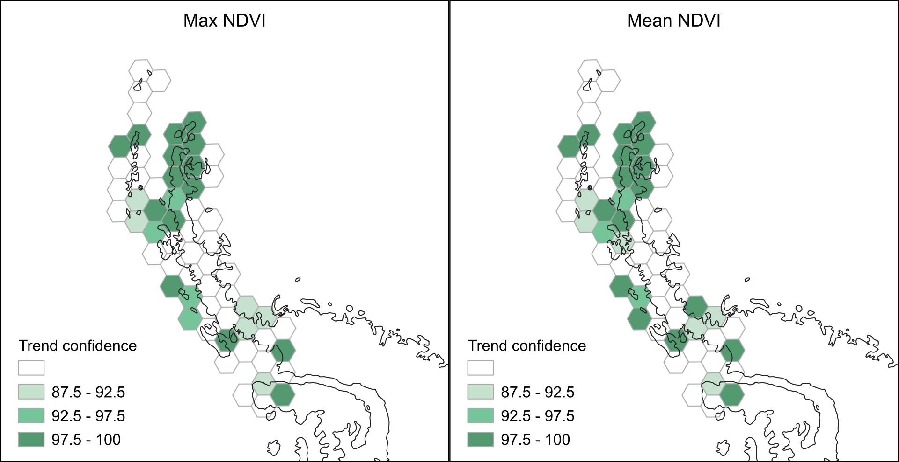

# Antarctic Peninsula greening from Landsat
Revisiting trends computed by Roland et al. 2024 (https://doi.org/10.1038/s41561-024-01564-5) (hereafter R24)

## Read NDVI tables
Run Earth Engine code from https://github.com/OllyBartlett/Roland_And_Bartlett_et_al_2024/

then replace 
```javascript
var composite = filtered.select('NDVI').reduce(ee.Reducer.max());
```
by
```javascript
var composite = filtered.select('NDVI').reduce(ee.Reducer.mean());
```

Generate two tables ```GAP_maxNDVI_Area.csv``` and ```GAP_meanNDVI_Area.csv```


## Total area analysis

Attempt to reproduce R24 Supp. Table 5.2, where MK's $z$ statistics is called ${\\tau}$ 


<style type="text/css">
</style>
<table id="T_da8be">
  <caption>
    Mann-Kendall test
    </caption>
  <thead>
    <tr>
      <th class="index_name level0" >method</th>
      <th id="T_da8be_level0_col0" class="col_heading level0 col0" >maxNDVI</th>
      <th id="T_da8be_level0_col1" class="col_heading level0 col1" >meanNDVI</th>
      <th id="T_da8be_level0_col2" class="col_heading level0 col2" >maxNDVI (R24)</th>
    </tr>
  </thead>
  <tbody>
    <tr>
      <th id="T_da8be_level0_row0" class="row_heading level0 row0" >z (${\tau}$)</th>
      <td id="T_da8be_row0_col0" class="data row0 col0" >2.271299</td>
      <td id="T_da8be_row0_col1" class="data row0 col1" >2.218478</td>
      <td id="T_da8be_row0_col2" class="data row0 col2" >2.310000</td>
    </tr>
    <tr>
      <th id="T_da8be_level0_row1" class="row_heading level0 row1" >p</th>
      <td id="T_da8be_row1_col0" class="data row1 col0" >0.023129</td>
      <td id="T_da8be_row1_col1" class="data row1 col1" >0.026522</td>
      <td id="T_da8be_row1_col2" class="data row1 col2" >0.021000</td>
    </tr>
  </tbody>
</table>


Another attempt to reproduce R24 Supp. Table 5.2 by filling no-data years with zeroes 
as per R24 "Trend analysis was conducted on the maximum annual area, with no-data years 
treated as zeroes, using a 1 year time interval"


<style type="text/css">
</style>
<table id="T_56dce">
  <caption>
    Mann-Kendall test
    </caption>
  <thead>
    <tr>
      <th class="index_name level0" >method</th>
      <th id="T_56dce_level0_col0" class="col_heading level0 col0" >maxNDVI</th>
      <th id="T_56dce_level0_col1" class="col_heading level0 col1" >meanNDVI</th>
      <th id="T_56dce_level0_col2" class="col_heading level0 col2" >maxNDVI (R24)</th>
    </tr>
  </thead>
  <tbody>
    <tr>
      <th id="T_56dce_level0_row0" class="row_heading level0 row0" >z (${\tau}$)</th>
      <td id="T_56dce_row0_col0" class="data row0 col0" >2.137597</td>
      <td id="T_56dce_row0_col1" class="data row0 col1" >2.109470</td>
      <td id="T_56dce_row0_col2" class="data row0 col2" >2.310000</td>
    </tr>
    <tr>
      <th id="T_56dce_level0_row1" class="row_heading level0 row1" >p</th>
      <td id="T_56dce_row1_col0" class="data row1 col0" >0.032550</td>
      <td id="T_56dce_row1_col1" class="data row1 col1" >0.034904</td>
      <td id="T_56dce_row1_col2" class="data row1 col2" >0.021000</td>
    </tr>
  </tbody>
</table>


Compute slope of the least-square regression line for both methods (not reported by R42)


<style type="text/css">
</style>
<table id="T_7dd5d">
  <caption>
    Least-square trend in km2/decade
    </caption>
  <thead>
    <tr>
      <th class="index_name level0" >method</th>
      <th id="T_7dd5d_level0_col0" class="col_heading level0 col0" >maxNDVI</th>
      <th id="T_7dd5d_level0_col1" class="col_heading level0 col1" >meanNDVI</th>
    </tr>
  </thead>
  <tbody>
    <tr>
      <th id="T_7dd5d_level0_row0" class="row_heading level0 row0" >trend</th>
      <td id="T_7dd5d_row0_col0" class="data row0 col0" >1.992376</td>
      <td id="T_7dd5d_row0_col1" class="data row0 col1" >1.797079</td>
    </tr>
  </tbody>
</table>


Area changes by period (reproduce Tab. 5.1 in R24)


<style type="text/css">
</style>
<table id="T_d2ab1">
  <caption>
    Area change in km2/decade 
    </caption>
  <thead>
    <tr>
      <th class="index_name level0" >method</th>
      <th id="T_d2ab1_level0_col0" class="col_heading level0 col0" >maxNDVI</th>
      <th id="T_d2ab1_level0_col1" class="col_heading level0 col1" >meanNDVI</th>
    </tr>
  </thead>
  <tbody>
    <tr>
      <th id="T_d2ab1_level0_row0" class="row_heading level0 row0" >1986-2021</th>
      <td id="T_d2ab1_row0_col0" class="data row0 col0" >3.135337</td>
      <td id="T_d2ab1_row0_col1" class="data row0 col1" >2.297203</td>
    </tr>
    <tr>
      <th id="T_d2ab1_level0_row1" class="row_heading level0 row1" >1986-2004</th>
      <td id="T_d2ab1_row1_col0" class="data row1 col0" >2.772457</td>
      <td id="T_d2ab1_row1_col1" class="data row1 col1" >2.319422</td>
    </tr>
    <tr>
      <th id="T_d2ab1_level0_row2" class="row_heading level0 row2" >2004-2016</th>
      <td id="T_d2ab1_row2_col0" class="data row2 col0" >2.941333</td>
      <td id="T_d2ab1_row2_col1" class="data row2 col1" >3.610947</td>
    </tr>
    <tr>
      <th id="T_d2ab1_level0_row3" class="row_heading level0 row3" >2016-2021</th>
      <td id="T_d2ab1_row3_col0" class="data row3 col0" >4.907314</td>
      <td id="T_d2ab1_row3_col1" class="data row3 col1" >-0.935774</td>
    </tr>
  </tbody>
</table>


## Number of observations analysis

The same GEE code was adapted to compute the average number of clear observations by polygon
```javascript
var composite = filtered.select('NDVI').reduce(ee.Reducer.count());
```
- code: https://code.earthengine.google.com/5f502d523fe82607c58311d45ef6e138
- output: ```GAP_countNDVI_Area.csv``` 


    

    


## Analysis by hexagon


    

    



